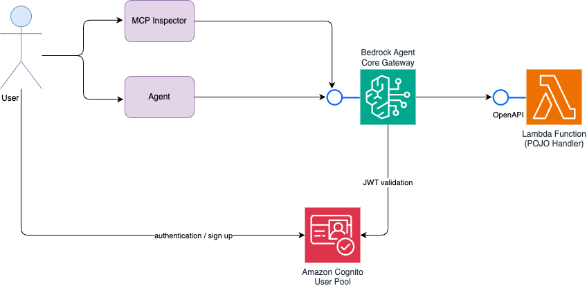

# AWS Agent Core Gateway with POJO Lambda

A serverless remote MCP server that exposes a Lambda POJO via the MCP protocol.


## Architecture

- **Lambda Function**: Event-driven handler processing incoming AWS service events and returning personalized greetings
- **Agent Core Gateway**: Bedrock Agent Core Gateway with Cognito-based authentication
- **Cognito User Pool**: Dedicated authentication stack for API access control



## Modules

- [cdk](cdk/) - AWS CDK infrastructure definitions
- [lambda](lambda/) - Lambda function implementation

## Prerequisites

- JDK 21 or later
- Apache Maven
- AWS CDK bootstrapped in target region:
  ```bash
  cdk bootstrap aws://ACCOUNT-ID/REGION
  ```

## Deployment

```bash
./buildAndDeployDontAsk.sh
```

## Connecting to the MCP Server

### Step-by-Step Authentication Flow

1. **Deploy the Infrastructure**
   ```bash
   ./buildAndDeployDontAsk.sh
   ```

2. **Create a User Account**
   - Navigate to the Cognito Hosted UI using the `agent-core-gateway-lambda-cognito-stack.UserSignUpURL` output
   - Sign up with email and password
   - Verify email address if required

3. **Obtain JWT Token**

   **Option A: Via Hosted UI**
   - Sign in through the Hosted UI
   - Extract the JWT token from the URL fragment after authentication (OAuth implicit grant flow)

   **Option B: Via AWS CLI**
   ```bash
   aws cognito-idp initiate-auth \
     --auth-flow USER_PASSWORD_AUTH \
     --client-id <client-id> \
     --auth-parameters USERNAME=<email>,PASSWORD=<password> \
     --query 'AuthenticationResult.AccessToken' \
     --output text
   ```

4. **Access the MCP Server**

   Use the JWT token to invoke the Agent Core Gateway:
   ```bash
   ./callMCPServer.sh <gateway-url> <jwt-token>
   ```

   Or with a custom payload:
   ```bash
   ./callMCPServer.sh <gateway-url> <jwt-token> payload.json
   ```

5. **Interactive Testing with MCP Inspector**
   ```bash
   npx @modelcontextprotocol/inspector <gateway-url>
   ```
   Configure the JWT token in the inspector's authentication settings to explore available tools and test requests interactively.